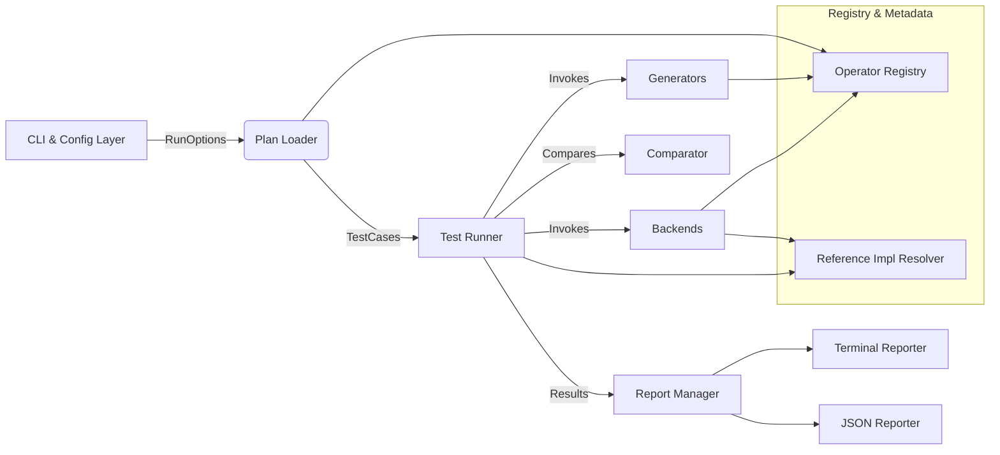

# optest Architecture & Extension Guide

## 1. High-Level Software Architecture



- **CLI & Config Layer** – uses Click to parse flags (`--op`, `--shape`, `--dtype`, `--backend`, etc.), merges YAML plan files, and builds `RunOptions` objects.
- **Plan Loader** – turns run options into normalized `TestCase` entries by resolving descriptors from the operator registry, applying dtype/shape/tolerance overrides, and attaching backend targets.
- **Operator Registry** – stores metadata for built-in and user-registered operators (supported dtypes, reference implementations, tolerances, tags, etc.).
- **Generators** – create deterministic NumPy inputs and, optionally, golden outputs. The default `RandomTensorGenerator` can be overridden via dotted-path references.
- **Reference Resolver** – loads NumPy-only reference implementations (ELEMENTWISE/GEMM/CONV/POOL/ACTIVATION) and falls back when generators don’t emit golden tensors.
- **Backends** – encapsulate actual kernel execution (CUDA, Ascend, etc.). The included stub backend delegates to the reference function for self-test.
- **Test Runner** – orchestrates generator → backend → comparator flow per test case, collects metrics, and streams structured results.
- **Report Manager & Reporters** – publish streaming output to the terminal (with `--no-color` support) and optional strict-schema JSON reports.

## 2. Core Design Concepts

### 2.1 Operator Descriptor & Test Case
- `OperatorDescriptor` captures static metadata (name, category, dtype tuples, attribute schema, generator/reference hooks, tolerance defaults).
- `TestCase` binds descriptors to concrete dtype tuples, shapes, backend targets, user attributes, tolerances, and optional overrides.

### 2.2 Generators & Reference Hooks
- Generators must expose a `.generate(case, rng)` method returning `(inputs, expected_outputs|None)`.
- Reference implementations are Python callables imported via dotted strings (e.g., `optest.operators.reference_impls:gemm_reference`).
- Custom generators or references can be registered via config, CLI overrides, or plugin modules loaded through `OPTEST_PLUGINS` env var.

### 2.3 Backend Abstraction
- Base class `BackendDriver` defines `kind`, `chips`, and `.run(case, inputs)`.
- `BackendManager` registers drivers and selects the best match based on CLI plan (`--backend`, `--chip`).
- Stub backend executes descriptors’ reference implementations; real drivers simply need to produce tensors shaped like the references.
- **Ascend backend**: ships as a command-runner wrapper that writes inputs to binary files, executes a user-provided script/binary (e.g., the `run.sh`/`ascendc_kernels_bbit` combo), and reads outputs back for comparison.

### 2.4 Reporting Pipeline
- `ReportManager` fans out lifecycle events (`on_start`, `on_case_result`, `on_complete`) to reporters.
- Terminal reporter prints progress plus detailed failure diagnostics (backend + chip, seed, shapes, tolerance, and per-tensor mismatch counts with worst-index/actual/expected values) and emits a condensed failure summary after execution.
- JSON reporter validates against `reporting/schema.py` before writing, ensuring compatibility when integrating with dashboards.

## 3. Extending optest with Custom GPU/NPU Backends

1. **Implement a backend driver**
   ```python
   from optest.backends import BackendDriver, backend_manager

   class MyCudaBackend(BackendDriver):
       kind = "gpu"
       name = "cuda-runtime"
       chips = ("a100", "h100")

       def run(self, case, inputs):
           # 1. Convert numpy inputs to device tensors
           # 2. Launch your CUDA kernel identified by case.descriptor.name
           # 3. Copy outputs back to numpy arrays and return a tuple/list
           return (run_my_kernel(case, inputs),)

   backend_manager.register(MyCudaBackend())
   ```

2. **Expose driver to the CLI**
   - Create a Python module (e.g., `my_company.optest_plugins.backends`) that registers the driver at import time.
   - Set `OPTEST_PLUGINS=my_company.optest_plugins.backends` before invoking `optest`, or import the module in your own CLI wrapper before calling `bootstrap()`.

3. **Handle chip-specific behavior**
   - Declare `chips = ("chipA", "chipB")` and branch inside `.run()` based on `case.backend.chip`. Return helpful errors if unsupported chips are requested.

4. **Tie into operator metadata**
   - If your backend only supports specific dtypes/shapes, extend or override operator descriptors via registry APIs before running tests.

### Tips
- Use case attributes (e.g., strides, paddings) to configure kernel launches.
- For remote hardware, your backend can call RPCs instead of local launches as long as `.run()` returns NumPy arrays.
- Implement additional drivers (e.g., `MyAscendBackend(kind="npu")`) to target NPUs; CLI selection happens via `--backend npu --chip ascend310b`.

### 3.1 Ascend Command Backend
- A convenient option for Ascend operator bring-up is the built-in `AscendBackendDriver` that shells out to your existing run scripts.
- Declare the mapping via `backend_config.ascend` inside a YAML plan or CLI attribute override. Example:

```yaml
cases:
  - op: relu
    shapes:
      input0: [8, 2048]
      output0: [8, 2048]
    backend_config:
      ascend:
        workdir: /path/to/add_custom
        command: ["bash", "run.sh", "-r", "cpu", "-v", "Ascend910B"]
        inputs:
          - tensor: input0
            path: input/input_x.bin
            dtype: float16
        outputs:
          - tensor: output0
            path: output/output_z.bin
            dtype: float16
```
- optest writes generator-produced tensors to the configured `input/*.bin` files, invokes your command, and expects the output file(s) to appear under `output/`.
- The backend can also run a lightweight Python script (see `tests/artifacts/ascend_backend/produce.py`) for CPU-debug flows.
- Use `tmp/add_custom/optest_plan_failure.yaml` together with `tmp/add_custom/simulate_failure.sh` to intentionally trigger a non-zero exit (42) and verify that optest surfaces command stderr/exit codes when operator launches fail.

## 4. Packaging & Distribution

### 4.1 Building Wheels / Source Distributions
- Ensure dependencies are up-to-date: `python -m pip install --upgrade build`.
- Run `python -m build` from the project root to create wheels and sdists under `dist/`.
- Publish via an internal index or PyPI (e.g., `python -m twine upload dist/*`).

### 4.2 Editable Installs for Contributors
```bash
python3 -m venv .venv
source .venv/bin/activate
pip install -e .
```

### 4.3 Installing Released Packages
- For end users: `pip install optest` (or your published name/version).
- They’ll receive the `optest` console script plus Python API for embedding (e.g., `from optest.core.runner import TestRunner`).

### 4.4 Delivering with Custom Plugins
- Package plugins in a separate distribution (e.g., `company-optest-plugins`) that depends on `optest`.
- Document environment variables or wrapper scripts that import plugin modules to register custom operators/backends automatically.

## 5. Usage Workflow Overview
1. Install the package (editable or from wheel).
2. Register any custom operators/backends via plugin modules.
3. Author YAML plans in `cases:` format or pass CLI overrides.
4. Run `optest run --plan my_plan.yaml --backend gpu --chip a100 --report json`.
5. Inspect terminal summaries and, if enabled, JSON reports under the provided path.
